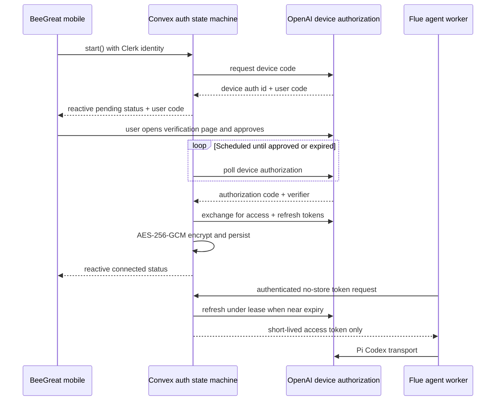

# Durable ChatGPT authentication

## Status and product boundary

BeeGreat uses Codex's device-code login behavior and Pi's open-source Codex
transport to let a signed-in BeeGreat user connect a ChatGPT subscription. The
implementation is deliberately marked **experimental**: OpenAI documents managed
ChatGPT OAuth for Codex surfaces and describes externally-owned ChatGPT tokens in
Codex app-server as experimental. Do not present this as a general OpenAI API
OAuth integration or promise that every ChatGPT plan/workspace permits it.

For a generally supported, usage-billed production provider, keep the existing
OpenRouter/OpenAI API path available. Enterprise automation should prefer the
official access-token path when the workspace exposes it.

## Architecture



The mobile app never receives an access token or refresh token. It sees only a
one-time user code and coarse connection status.

## Persistence and concurrency

- `chatgptAuthSessions` stores the durable device-flow state. The device auth id
  is encrypted and polling is one scheduled Convex action per attempt, so no
  request is held open and the flow survives app termination or backend restarts.
- `chatgptCredentials` stores one credential per Clerk user. Both OAuth tokens
  use AES-256-GCM with field- and user-specific associated data.
- Refresh claims a 30-second database lease. Only the lease owner may persist a
  rotated refresh token; concurrent agent requests receive a retry response.
- Permanent refresh rejection removes encrypted token material and changes the
  client-visible state to `needs_reauth`.
- Disconnect deletes the credential row and cancels active authorization state.

## Trust boundaries

1. Clerk authenticates the mobile user to public Convex functions.
2. Public functions derive `userId` from `ctx.auth`; clients never select another
   user's credential owner.
3. The Flue Worker reaches `/internal/chatgpt/token` with
   `AGENT_CREDENTIAL_BROKER_SECRET`. The secret is server-only, compared in
   constant time, and separate from Clerk and service-bridge credentials.
4. The broker response uses `Cache-Control: no-store` and never returns refresh
   tokens.
5. Flue registers a provider id derived from a hash of the Clerk user id. Provider
   credentials therefore cannot be overwritten by a concurrent different user in
   the same Worker isolate.

## Environment setup

Generate two independent values locally:

```sh
openssl rand -base64 32 # CHATGPT_CREDENTIALS_KEY
openssl rand -hex 32    # AGENT_CREDENTIAL_BROKER_SECRET
```

Set both on the Convex deployment:

```sh
bunx convex env set CHATGPT_CREDENTIALS_KEY '<base64-key>'
bunx convex env set AGENT_CREDENTIAL_BROKER_SECRET '<broker-secret>'
```

Set the broker secret on the agent Worker:

```sh
bunx wrangler secret put AGENT_CREDENTIAL_BROKER_SECRET
```

The Worker also needs `CONVEX_URL`; `CONVEX_SITE_URL` is optional for standard
`*.convex.cloud` deployments because BeeGreat derives the corresponding
`*.convex.site` HTTP-action origin.

For local development, place only agent-side values in
`packages/agent/.dev.vars`. Convex secrets still belong in the selected Convex
development deployment, not in that file.

## Operations

- **Encryption-key rotation:** the current schema records encryption version 1.
  Changing the key invalidates existing ciphertext, so require users to reconnect.
  A future online rotation can add a new version and dual-key decrypt window.
- **Broker-secret rotation:** update Convex and the Worker together. During a
  rolling deployment, temporary agent fallback to OpenRouter is preferable to
  accepting two long-lived broker secrets.
- **Revocation:** users disconnect from BeeGreat to delete stored credentials and
  should also revoke the Codex/ChatGPT authorization from their OpenAI account when
  a device is lost or compromise is suspected.
- **Logs:** never log request authorization headers, broker responses, OAuth
  response bodies, access tokens, refresh tokens, device auth ids, or encryption
  keys. Error codes are intentionally coarse.
- **Backups:** encrypted rows are safe only while the encryption key remains
  separate from database exports. Treat a database export plus the key as live
  credential material.

## Local-only Pi compatibility

`bun run mobile:chatgpt:pi` preserves the earlier developer workflow. It reads
`~/.pi/agent/auth.json`, refreshes the credential in place, and injects only the
short-lived token into a Node-target Flue process. It is not used by the durable
mobile flow and must not be deployed as a shared user credential.
